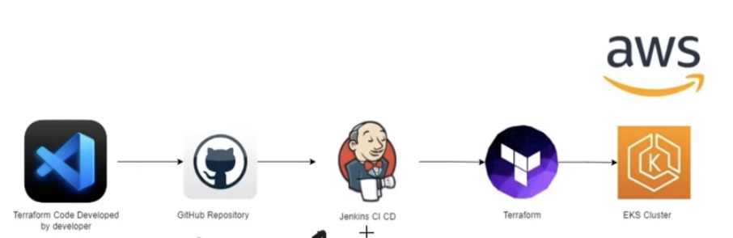
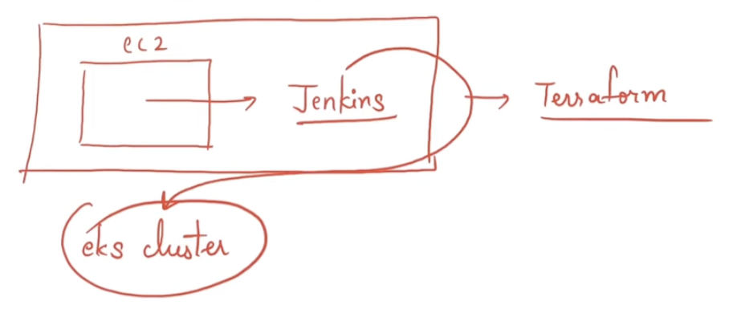

# Real-time End-to-end DevOps project: Deploying an AWS EKS Cluster with Terraform and Jenkins



## EKS: Elastic Kubernetes Service
* Its a managed Service.

## Steps


1. Create EC2 Instance
2. Install Jenkins in it.
3. Write Terraform Code for EKS Cluster.
4. Push the changes to GitHub.
5. Create a Jenkins Pipeline --> to deploy EKS Cluster.
6. Deploy the changes to AWS.
7. Implement a deployment file using kubectl.

**Note**: `aws configure` has to be set prior to start coding with AWS and Terraform.

## Coding


After EC2 Instance is Up and Running, take the public IP and run in browser, should able to see Jenkins page.

# Configure Jenkins on EC2
Next is to Configure Jenkins, SSH into the EC2 Instance.
Run the command to get the pass-code: 
```
sudo cat /var/lib/jenkins/secrets/initialAdminPassword
```
Past the Pass-Code in the browser.
Go with the Suggested Plugins.

Provide details as asked.
