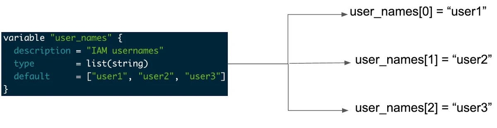
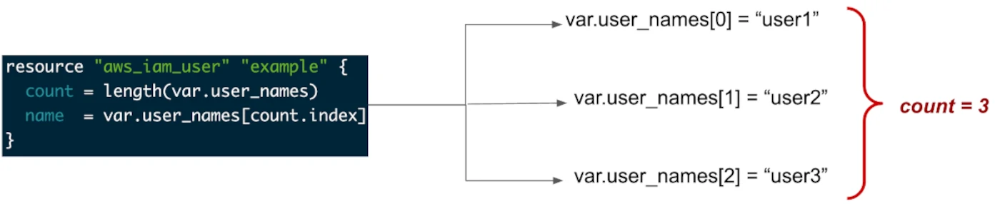

# Terraform Playground
Playing with Terraform

1. Random Provider
The random provider allows the use of randomness within Terraform configurations. This si a logical provider, which means that it works entirely within Terraform's logic and doesn't interact with any other services.

For Examples on this refer [01_Randon Folder](01_Random).
We are going to create a simple terraform program that genertaes and deploys a `random pet`. It is more like a coidng playground than an actual infrastructure components, as it genertaes a random, memorable name intended to be used for unique idempotent resources.

The name consists of a random animal and a two-word adjective, like "smart-tutrle" or "striking-crayfish". The random_pet resource takes a prefix and length as input and generates a random name accordingly.

In the said folder example code, I have use two major Terraform commands:
`random_pet` and `output`.

* The `random_pet` command is part of a suite of miscellaneous randomization functions that terraform provides, used here to genertae a random name for our resource.
* The `output` command allows us to view the output of our Terraform operations, in this case it will output the generated pet name.

One important point is the `keepers` agrument. This object allows us to specify valus that, when changed, will trigger a new name to be genertaed even though the length, prefix and separator haven't changed. 
Here, we are using a hard coded string "My Value", but in real case scenario this could be any other data that may change over time and requires a new name.

2. Archive Provider

## 3. Understanding terraform count, for_each and for loop
When working with "collection variables" in Terrafrom, you must understand "loops with count," "loops with for each," and "for loop." If you don't, it will be very hard to go through collections like list, map, and set.

### Loops with count
#### Iterate List using count
As the name suggests we need to use count but to use the count first we need to declare collections inside our terraform file.

Let's create a collection variable of type list(string) -

        variable "user_names" {
        description = "IAM usernames"
        type        = list(string)
        default     = ["user1", "user2", "user3"]
        }

Here is the pictorial representation of the above list variable -

In the above collection, we have created a list of type string which contains usernames and these usernames we are going to use for creating aws_iam_user.

The code snippet shows how we are going to iterate over the list(string) -  

        resource "aws_iam_user" "example" {
        count = length(var.user_names)
        name  = var.user_names[count.index]
        }

Here is the complete terraform file -

        provider "aws" {
        region     = "eu-central-1"
        access_key = "XXXXXXXXXXXXXXXX"
        secret_key = "XXXXXXXXXXXXXXXX"
        }
        resource "aws_instance" "ec2_example" {

        ami           = "ami-0767046d1677be5a0"
        instance_type =  "t2.micro"
        count = 1

        tags = {
                Name = "Terraform EC2"
        }

        }

        resource "aws_iam_user" "example" {
        count = length(var.user_names)
        name  = var.user_names[count.index]
        }

        variable "user_names" {
        description = "IAM usernames"
        type        = list(string)
        default     = ["user1", "user2", "user3"]
        }

Once you apply this terraform configuration using the terraform apply command, it will do the following on aws-

Create one ec2 instance
Create three IAM users - user1, user2, user3

